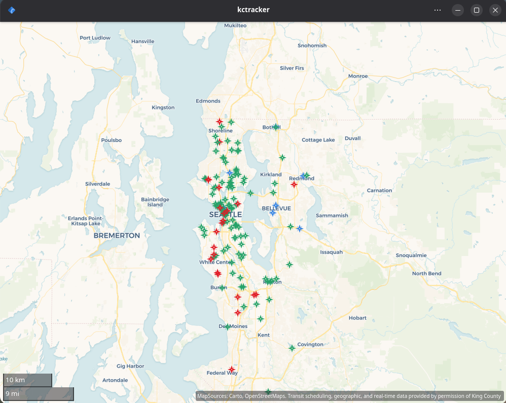
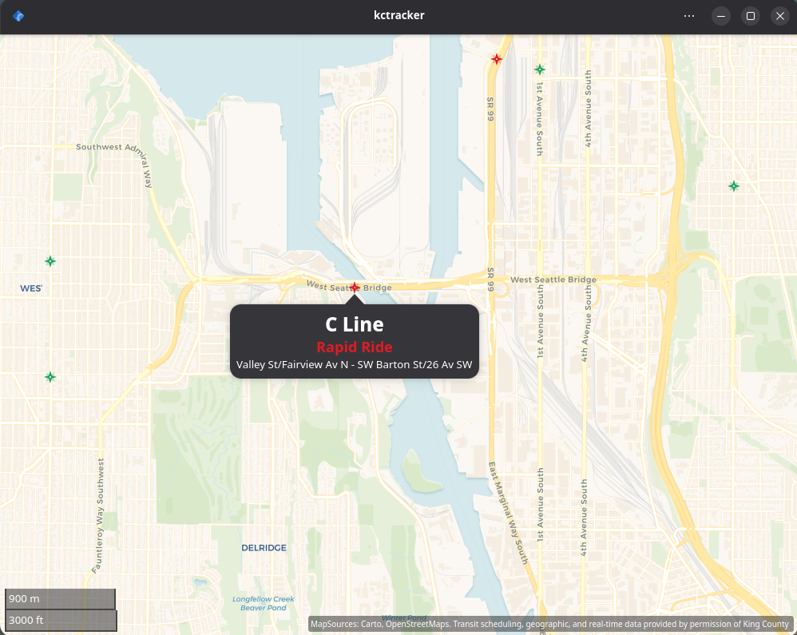
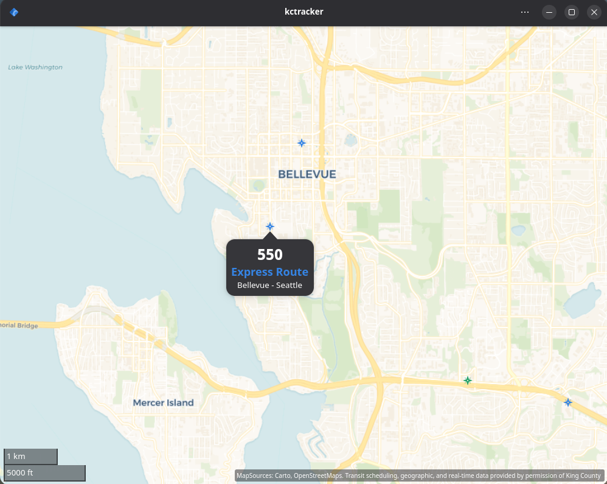
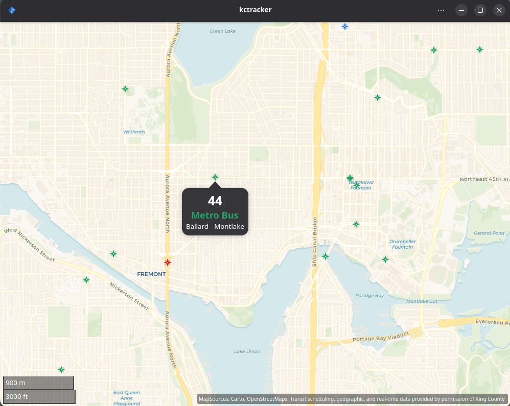

# Public Version
*Private Version contains personally identifiable information*

# KCTracker
A GTK project used to see King County (WA, USA) bus transit.

## Full Map Example

## Example of a "Rapid Ride"-type Bus Info

## Example of a "Express Bus"-type Bus Info

## Example of a "Metro Bus"-type Bus Info

